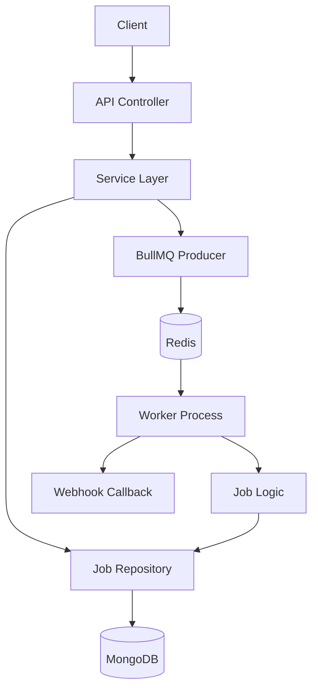

# BP Optima: Production-Ready Document Processing System

BP Optima is a scalable, reliable back-end service built with Node.js, TypeScript, and **Clean Architecture**. It provides an asynchronous workflow for document processing using **BullMQ (Redis)** and **MongoDB**.

---

## 🏗️ Architecture Design

The project strictly follows **Clean Architecture** principles to ensure maintainability and testability:



### Layers:
- **Controllers**: Handle HTTP requests and input mapping.
- **Services**: Orchestrate business logic and workflow between persistence and queues.
- **Repositories**: Standardize data access for MongoDB.
- **Interfaces**: Centralize domain-driven data definitions.
- **Queue/Worker**: Handle background task offloading and state transitions.

---

## 🛠️ Setup & Prerequisites

### 1. Requirements
- **Node.js**: v18+
- **Redis**: Local or cloud instance.
- **MongoDB**: Atlas or local server.
- **Docker**: (Optional for containerized setup).

### 2. Environment Configuration
Create a **`.env`** file in the root:
```env
# Server
PORT=3000

# Database
MONGODB_URI=mongodb+srv://...

# Redis
REDIS_HOST=127.0.0.1
REDIS_PORT=6379

# Environment
NODE_ENV=development
```

---

## 🚀 How to Run

### Manual Setup
1. **Install dependencies**: `npm install`
2. **Build the project**: `npm run build`
3. **Start API Server**: `npm run dev`
4. **Start Background Worker**: `npm run worker`

### Docker Support (Recommended)
Launch the entire stack (API + Worker + Redis) with a single command:
```bash
docker-compose up --build
```

---

## 📋 API Documentation

### Job Management (`/jobs`)

| Method | Endpoint | Description |
| :--- | :--- | :--- |
| **POST** | `/jobs` | Create a job via URL or file upload. |
| **GET** | `/jobs` | List all historical and active jobs. |
| **GET** | `/jobs/:id` | Get detailed status and results for a job. |

#### Create Job Payload:
- **JSON**: `{ "fileUrl": "...", "webhookUrl": "..." }`
- **Multipart**: Key `file` (binary) and metadata in the body.

---

## 🧪 Testing Webhooks
To verify callback functionality:
1. Use **[Beeceptor](https://beeceptor.com)** to create a mock endpoint.
2. Provide that URL during job creation as `webhookUrl`.
3. Wait **10–20s** and check Beeceptor for the result POST.

---

## 📄 License
MIT
